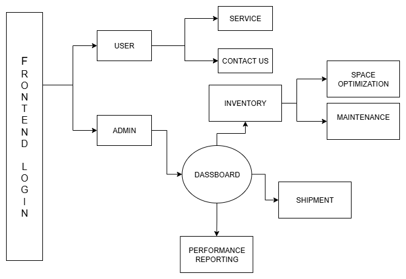

# Logistic Warehouse Management System (LWMS)

## Overview
The Logistic Warehouse Management System (LWMS) is a web-based application designed to streamline the management of warehouse operations. It provides functionalities for inventory management, shipment handling, space optimization, maintenance scheduling, and performance reporting.

## UML Diagram


## Project Structure
The project is organized into the following directories and files:

```
Logistic-warehouse-cms-1
├── Frontend
│   ├── dashboard.html          # Main dashboard for the application
│   ├── shipment.html           # Page for managing shipments
│   ├── manage_space.html       # Dashboard for filtering product space occupancy
│   ├── css
│   │   └── style.css           # Styles for the frontend application
│   ├── js
│   │   └── script.js           # JavaScript for handling user interactions
│   └── README.md               # Documentation for the frontend part of the project
└── README.md                   # Main documentation for the entire project
```

## Features
- **Inventory Management**: Add, update, and view inventory items.
- **Shipment Handling**: Manage shipments and track their status.
- **Space Optimization**: Analyze and optimize space occupancy in the warehouse.
- **Maintenance Scheduling**: Schedule and manage maintenance tasks.
- **Performance Reporting**: Generate reports on various performance metrics.

## Setup Instructions
1. Clone the repository to your local machine.
2. Navigate to the `Frontend` directory.
3. Open `dashboard.html` in a web browser to access the application.
4. Ensure that all necessary dependencies are included in the project.

## Usage
- Use the navigation menu to access different modules of the application.
- Follow the prompts and forms to manage inventory, shipments, and space optimization.

## Contributing
Contributions are welcome! Please submit a pull request or open an issue for any enhancements or bug fixes.


# Frontend Logistics Warehouse Management System

This directory contains the frontend files for the Logistics Warehouse Management System (LWMS). Below is an overview of the key files and their purposes:

## File Structure

- **dashboard.html**: 
  - The main dashboard for the LWMS. It includes navigation options and sections for various functionalities such as inventory management, space optimization, shipment handling, maintenance scheduling, and performance reporting.

- **shipment.html**: 
  - Dedicated to shipment handling. This file includes sections for managing inventory and displaying charts related to inventory.

- **manage_space.html**: 
  - A new page that includes a dashboard for filtering product space occupancy. It features a user interface for managing space optimization.

- **css/style.css**: 
  - Contains styles for the frontend application, including layout, colors, and responsive design.

- **js/script.js**: 
  - Contains JavaScript code for handling user interactions and dynamic content updates within the frontend application.

## Usage

To run the application, open `dashboard.html` in a web browser. Navigate through the various sections to manage inventory, shipments, and space optimization.

## Future Enhancements

- Implement additional features for space optimization in `manage_space.html`.
- Enhance the user interface for better user experience.
- Integrate backend services for data management and retrieval.

For any issues or contributions, please refer to the main project README or contact the project maintainers.